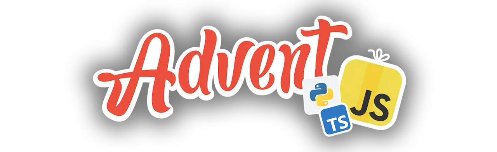

<h1 align="center">
    AdventJS Solutions 🎅🎄
</h1>

<h4 align="center">
    Repository of <a href="https://adventjs.dev/" target="_blank">AdventJS<a> programming challenges by <a href="https://www.linkedin.com/in/midudev/" target="_blank">Midudev</a>.
</h4>

    <a href="#----summary">Summary</a> •
    <a href="#----challenges">Challenges</a> •
    <a href="#----license">License</a> •
    <a href="#----acknowledgments">Acknowledgments</a> •

    

<h2>
    Summary
</h2>

    This repository serves as a housing solutions to programming challenges of <a href="https://adventjs.dev/" target="_blank">AdventJS<a>. AdventJS, a project developed by <a href="https://www.linkedin.com/in/midudev/" target="_blank">Midudev</a>, offers a platform for developers to improve JavaScript or TypeScript skills, through a series of daily challenges spanning 25 days. The challenge begins on December 1st and culminates on December 25th.

<h2>
    Year
</h2>

|     #     | Challenge                                      | Difficulty | Stars earned |     Description      |
| :-------: | ---------------------------------------------- | :--------: | :----------: | :------------------: |
|    01     | 2024        |     🟢     |         | [Show](./2024/)  |
|    02     | 2025        |     🟢     |         | [Show](./2025/)  |

<h2>
    License
</h2>

    This repository is under <a href="./LICENSE" target="_blank">MIT License</a>, if you want to see what you are allowed to do with the content of this repository, please visit <a href="https://choosealicense.com/licenses/" target="_blank">choosealicense</a> for more information.

<h2>
    Acknowledgments
</h2>

    Thanks to <a href="https://www.linkedin.com/in/midudev/" target="_blank">Miguel Ángel Durán</a> to develop <a href="https://adventjs.dev/" target="_blank">AdventJS<a>.

